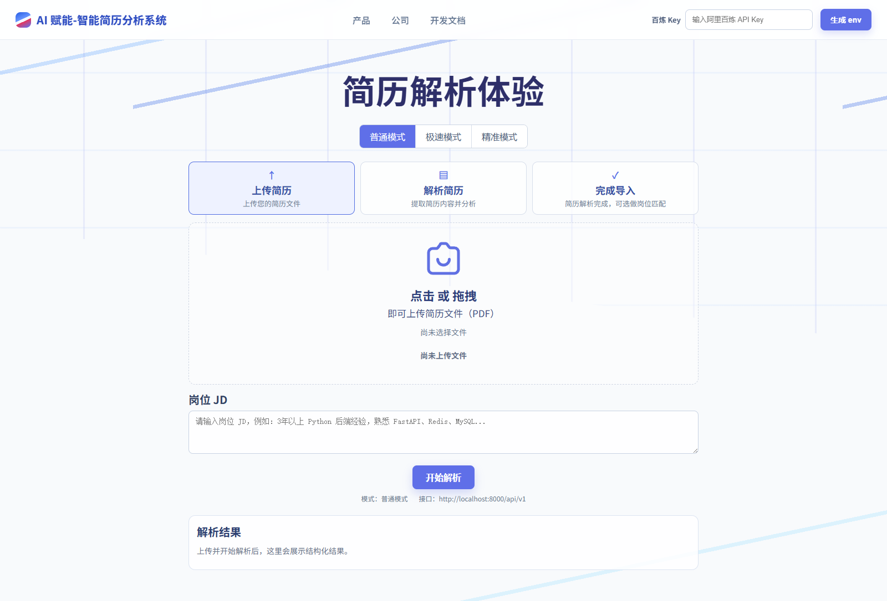
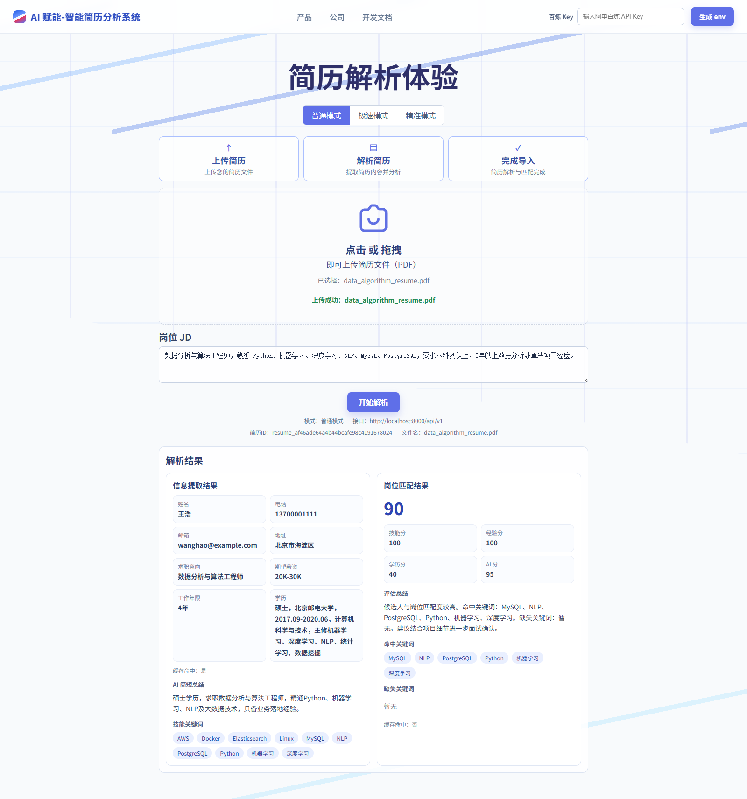
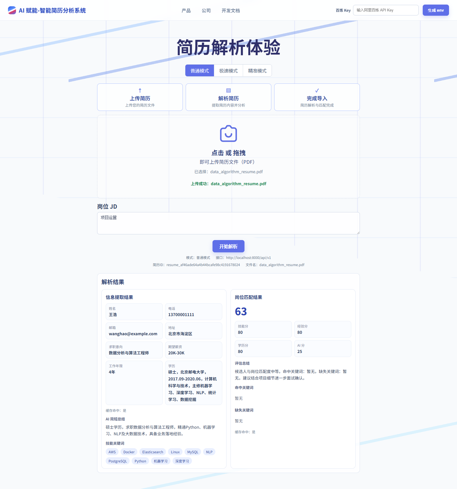

# AI 赋能的智能简历分析系统

本项目是一个面向招聘场景的智能简历分析系统，支持上传 PDF 简历，自动解析文本内容，提取候选人关键信息，并结合岗位 JD 计算简历与岗位的匹配度评分。

项目当前已完成本地可演示闭环：前端支持上传简历、输入岗位 JD、配置阿里百炼 Key；后端支持 PDF 解析、AI 信息抽取、AI 简短总结、岗位匹配评分、缓存命中展示和调试环境变量生成。

## 界面截图

### 上传与阿里百炼 Key 调试



### 解析结果与岗位匹配



### 匹配度较低示例



## 核心功能

- PDF 简历上传与多页文本解析
- 简历文本清洗、分段与结构化处理
- 基本信息提取：姓名、电话、邮箱、地址
- 扩展信息提取：求职意向、期望薪资、工作年限、学历背景、项目经历
- AI 简短总结：解析后自动生成候选人概览
- 岗位 JD 关键词提取与能力要求分析
- 简历与岗位需求匹配评分
- 阿里百炼 Key 调试入口：前端输入 Key，后端自动生成 `.env`
- JSON 格式返回结构化分析结果
- 缓存已解析简历与评分结果，减少重复计算
- 前端页面支持上传简历、输入 JD、查看分析报告
- 提供测试 PDF 与后端自动化测试

## 技术选型

| 模块 | 技术 |
| --- | --- |
| 后端框架 | Python + FastAPI |
| 运行环境 | 本地 FastAPI，后续可部署到阿里云函数计算 FC |
| API 暴露 | FastAPI RESTful API，后续可接阿里云 API 网关 / FC HTTP 触发器 |
| PDF 解析 | pypdf，pdfplumber，pypdfium2 |
| AI 模型 | 阿里云百炼 DashScope 兼容 OpenAI API |
| 缓存 | MVP 阶段使用内存缓存 |
| 文件存储 | MVP 阶段使用内存存储，后续可接 OSS |
| 前端 | React + Vite |
| 前端部署 | 本地 Vite，后续可部署 GitHub Pages |

## 项目结构

```text
resume-ai-analyzer/
├── backend/
│   ├── app/
│   │   ├── api/                 # RESTful API 路由
│   │   ├── core/                # 配置、日志、异常处理
│   │   ├── models/              # Pydantic 数据模型
│   │   ├── services/            # PDF 解析、AI 抽取、匹配评分、缓存
│   │   └── main.py              # FastAPI 应用入口
│   ├── requirements.txt
│   ├── tests/
│   └── README.md
├── frontend/
│   ├── src/
│   ├── package.json
│   └── README.md
├── docs/
│   ├── 系统架构设计.md
│   ├── 功能清单.md
│   ├── API接口文档.md
│   ├── 部署说明.md
│   ├── 现场演示脚本.md
│   ├── images/
│   └── test-pdfs/
└── README.md
```

## 快速开始

后端本地运行：

```bash
cd backend
pip install -r requirements.txt
uvicorn app.main:app --reload --port 8000
```

前端本地运行：

```bash
cd frontend
npm install
npm run dev
```

浏览器打开：

```text
http://127.0.0.1:5173
```

后端健康检查：

```text
http://127.0.0.1:8000/api/v1/health
```

## 环境变量

```bash
DASHSCOPE_API_KEY=你的阿里百炼 API Key
MODEL_BASE_URL=https://dashscope.aliyuncs.com/compatible-mode/v1
MODEL_NAME=qwen-plus
MODEL_NAME_FAST=qwen3.5-flash
MODEL_NAME_PRECISE=qwen3.5-plus
MODEL_NAME_PRECISE_OCR=qwen-vl-ocr-latest
PRECISE_MAX_OCR_PAGES=3
MAX_FILE_SIZE_MB=10
CORS_ORIGINS=http://localhost:5173,http://127.0.0.1:5173
```

调试阶段也可以直接在前端顶部输入“百炼 Key”，点击“生成 env”，后端会自动生成 `backend/.env`。该文件已被 `.gitignore` 忽略，不会提交到仓库。

## 测试文件

项目内置 4 份 PDF 测试简历：

- `docs/test-pdfs/backend_python_resume.pdf`
- `docs/test-pdfs/frontend_react_resume.pdf`
- `docs/test-pdfs/data_algorithm_resume.pdf`
- `docs/test-pdfs/product_operation_resume.pdf`

可用 `data_algorithm_resume.pdf` 搭配“项目运营”作为 JD，演示匹配度较低或岗位方向不一致的场景。

后端测试：

```bash
cd backend
python -m pytest -q
```

前端构建：

```bash
cd frontend
npm run build
```

## 文档导航

- [系统架构设计](docs/系统架构设计.md)
- [功能清单](docs/功能清单.md)
- [API 接口文档](docs/API接口文档.md)
- [部署说明](docs/部署说明.md)
- [现场演示脚本](docs/现场演示脚本.md)

## 提交信息

- GitHub 仓库地址：https://github.com/shiyican413-ctrl/AI-Resume-Extraction
- 线上演示地址：待补充，本地演示地址为 `http://127.0.0.1:5173`
- 作者姓名：待补充
- 联系方式：待补充
